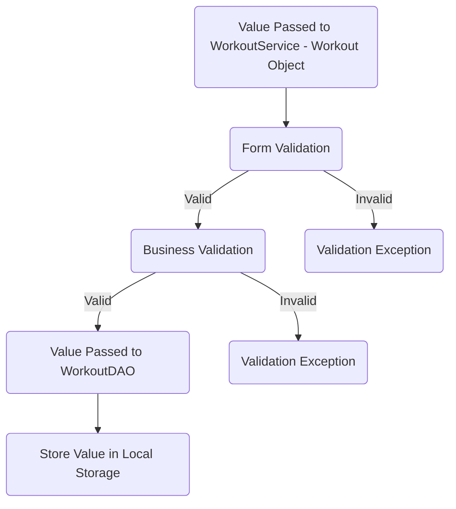
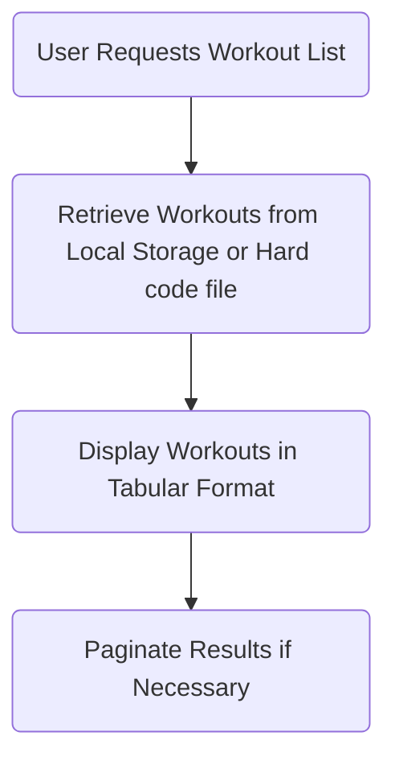
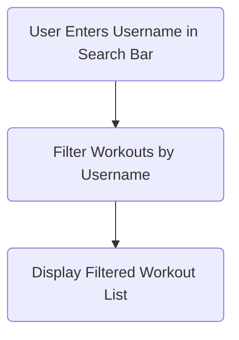
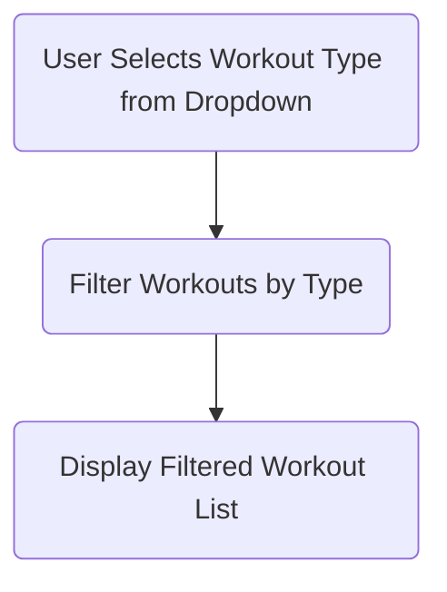
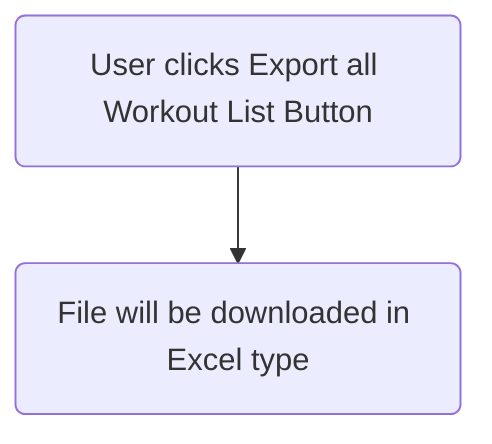

#  FyleHealth Challenge Tracker
## Overview
Health Challenge Tracker is a single-page application (SPA) built with Angular 14+ designed to help users log and track their workouts. The application allows users to input their workout details, view their workout history, and search or filter their workouts. Additionally, it features pagination to handle large lists of workouts efficiently. An optional feature for displaying workout progress using charts is also included.

## Features
- User-Friendly Input: Users can easily input their name, workout type, and workout duration.
- Workout List Display: View a comprehensive list of all workouts.
- Search Functionality: Quickly find workouts by searching for a user name.
- Filter by Workout Type: Filter the workout list to show specific types of workouts.
- Export Workout list: Export the workout list in excel sheet. [NEW]
- Pagination: Efficiently navigate through large lists of workouts.
- Optional Chart Feature: Display workout progress using visually appealing charts (under development).

## Usage
### Adding a workout

#### User Story:
> User can create a new workout.

#### Steps:
   - Enter your name in the "User Name" field.
   - Select the type of workout from the "Workout Type" dropdown.
   - Enter the duration of the workout in minutes.
   - Click the "Add Workout" button to log your workout.

#### Validations:
- [ ] Form Validation
-  Username ( null, empty, pattern )
-  Workout type ( null, empty, pattern )
-  Workout minutes ( null, empty, pattern )

- [ ] Business Validation 
- Username Already exists.

#### Messages: 
- Username should not be null.
- Username should not be repetitive.
- Workout option is required to add a workout.
- Workout minutes should not be less than 1.
- Workout minutes should not exceed a reasonable limit.

#### Flow:


### Viewing Workouts:

#### User Story:
> User can view a list of all workouts.

#### Steps:
   - All logged workouts are displayed in the workout list.
   - Use the search bar to find workouts by user name.
   - Use the filter dropdown to display specific types of workouts.
   - Navigate through pages using the pagination controls at the bottom of the list.

#### Features:
- Display all workouts in a tabular format.
- Show workout details including username, workout type, and workout duration.

#### Pagination:
- Efficiently navigate through large lists of workouts.

#### Flow:


#### Search by Username

#### User Story:
> User can search for workouts by username.

#### Steps:
- Click "Search bar" to give username.

#### Flow:


#### Filter by Workout type

#### User Story:
> User can filter workouts by workout type.

#### Steps:
- Click "Filter by workout type dropdown" to select workout type.

#### Flow:


#### Export all Workout list [NEW]

#### User Story:
> User can export all the workout list.

#### Steps:
- Click "Export all workout list" button to export the workout list in excel file.

#### Flow:


### Optional Feature - Workout Progress Charts:
   - Under development. This feature will display workout progress using charts for a more visual representation of your activity.

## Project Structure
```java

health-challenge-tracker/
├── src/
│   ├── app/
│   │   ├── components/
│   │   │   ├── add-workout/
│   │   │   ├── workout-list/
│   │   │   └── workout-progress-chart/
│   │   ├── models/
│   │   ├── services/
│   │   ├── app-routing.module.ts
│   │   ├── app.component.html
│   │   ├── app.component.ts
│   │   └── app.module.ts
│   ├── assets/
│   ├── environments/
│   ├── index.html
│   └── styles.css
├── .gitignore
├── angular.json
├── package.json
└── README.md


```
## Contact

For any questions or suggestions, please open an issue on GitHub or contact me directly at [Mail](vigneshwarjosephite@gmail.com).

-----
Thank you for using FyleHealth Challenge Tracker! Stay fit and healthy!

